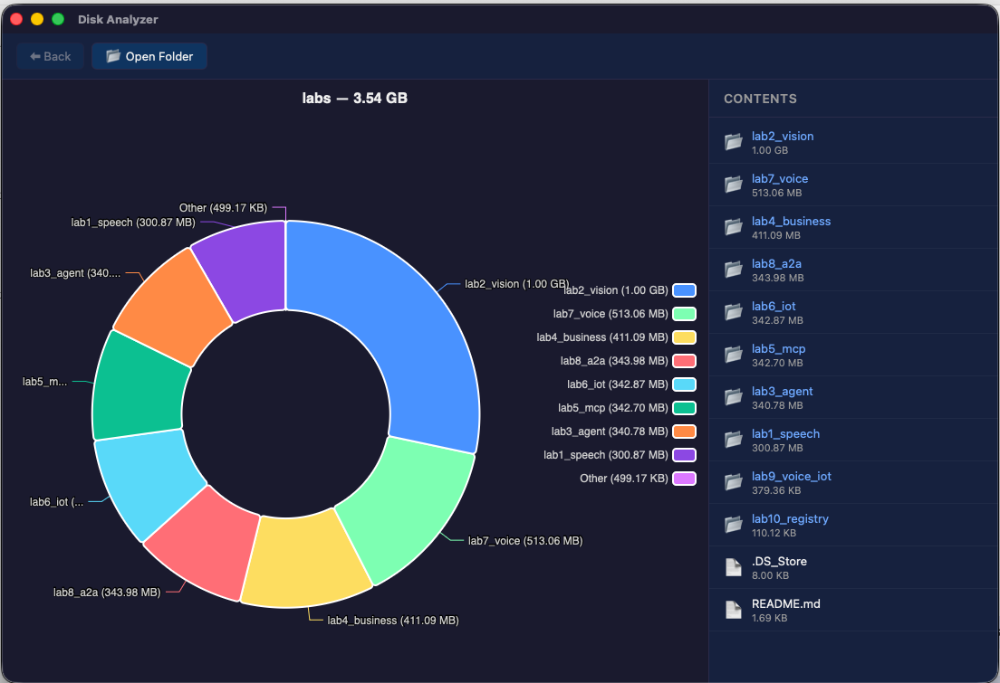

# Disk Analyzer

A desktop application that scans your file system and visualizes disk usage through an interactive pie chart, helping you quickly identify large folders and files so you can reclaim storage space. Browse your directory tree, see sizes at a glance, and delete or clean folders — all from a single native window.

## Origin story

One evening not having enough space on my computer I decided to build an app that allows me to see and manage big folders... and so my prompting journey started.

## About



## Tech stack

- Rust (edition 2021)
- Tauri v2 — native desktop app with WebView frontend
- Charming — Rust chart library (Apache ECharts)
- ECharts — interactive pie chart rendering in the frontend

## Project structure

```
disk-utility/
├── frontend/          # HTML/CSS/JS frontend
│   ├── index.html
│   ├── style.css
│   └── app.js
├── src-tauri/         # Rust backend (Tauri)
│   ├── Cargo.toml
│   ├── tauri.conf.json
│   └── src/
│       ├── main.rs
│       └── lib.rs
└── README.md
```

## Build & run

```bash
cd src-tauri
cargo tauri dev
```

## Functionality

- As a user I want to open an application that shows me a folder structure so I can navigate through it
- As a user I want to see in the folder structure the size of it and its files
- As a user I want to be able to delete folders or files from the structure
- As a user I want to navigate through a pie chart instead of folder structure so that I can better visualize the app
- As a user I want to click on Others and expand the Others group
- As a user I want to delete all the files in a folder (clean) but keep the folder since it can be used as a path to save temp files for example
